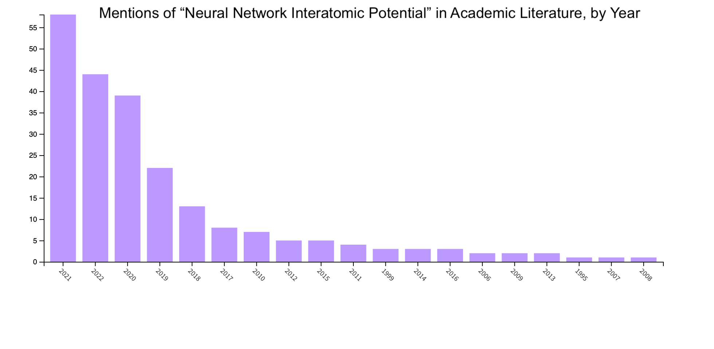
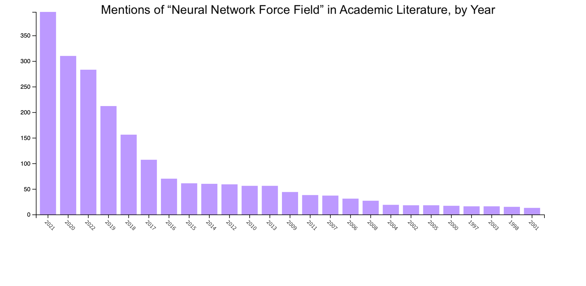

# Deep Learning for Atomistic Simulation

This document aims to serve as a concise overview of literature that discusses the application of deep learning to the problem of atomistic simulation, an emerging field that is growing at a rapid pace:

This repository is a result of my personal attempt to parse existing literature and understand the different approaches from the various groups that are publishing in the field. It is intentionally *not* comprehensive; I have attempted to only select articles that characterize trends in the development of the field. Also, there are just too many papers, and it seems unproductive to spend more time searching for papers than reading them.

Please feel free to open an issue or pull requests.

# Methods

## Embeddings and Representations

### Atomic Representations

[SISSO: A compressed-sensing method for identifying the best low-dimensional descriptor in an immensity of offered candidates](https://journals.aps.org/prmaterials/abstract/10.1103/PhysRevMaterials.2.083802)

[Unified theory of atom-centered representations and message-passing machine-learning schemes](https://aip.scitation.org/doi/pdf/10.1063/5.0087042)

[Physics-Inspired Structural Representations for Molecules and Materials](https://pubs.acs.org/doi/10.1021/acs.chemrev.1c00021)

[Atomic cluster expansion for accurate and transferable interatomic potentials](https://journals.aps.org/prb/abstract/10.1103/PhysRevB.99.014104)

[Atomic cluster expansion: Completeness, efficiency and stability](https://www.sciencedirect.com/science/article/pii/S0021999122000080?via%3Dihub)

[Multilayer atomic cluster expansion for semi-local interactions](https://arxiv.org/pdf/2205.08177.pdf)

[Atomic cluster expansion of scalar, vectorial and tensorial properties and including magnetism and charge transfer](https://arxiv.org/abs/2003.00221)

[Fourier series of atomic radial distribution functions: A molecular fingerprint for machine learning models of quantum chemical properties](https://onlinelibrary.wiley.com/doi/abs/10.1002/qua.24912)

[Continuous and optimally complete description of chemical environments using Spherical Bessel descriptors](https://aip.scitation.org/doi/10.1063/1.5111045)

[Optimized symmetry functions for machine-learning interatomic potentials of multicomponent systems](https://aip.scitation.org/doi/10.1063/1.5040005)

[Atom-centered symmetry functions for constructing high-dimensional neural network potentials](https://aip.scitation.org/doi/abs/10.1063/1.3553717)

[Atom-density representations for machine learning](https://aip.scitation.org/doi/10.1063/1.5090481)

[Efficient implementation of atom-density representations](https://arxiv.org/abs/2101.08814)

[Constant size descriptors for accurate machine learning models of molecular properties](https://aip.scitation.org/doi/10.1063/1.5020441)

[Descriptors representing two- and three-body atomic distributions and their effects on the accuracy of machine-learned inter-atomic potentials](https://aip.scitation.org/doi/10.1063/5.0009491)

[The role of feature space in atomistic learning](https://iopscience.iop.org/article/10.1088/2632-2153/abdaf7)

[Incompleteness of Atomic Structure Representations](https://journals.aps.org/prl/abstract/10.1103/PhysRevLett.125.166001)

[Geometric deep learning on molecular representations](https://www.nature.com/articles/s42256-021-00418-8)

[TUCAN: A molecular identifier and descriptor applicable to the whole periodic table from hydrogen to oganesson](https://europepmc.org/article/ppr/ppr479842)

[Could graph neural networks learn better molecular representation for drug discovery? A comparison study of descriptor-based and graph-based models](https://jcheminf.biomedcentral.com/articles/10.1186/s13321-020-00479-8)

[On representing chemical environments](https://arxiv.org/abs/1209.3140)

[Optimizing many-body atomic descriptors for enhanced computational performance of machine learning based interatomic potentials](https://arxiv.org/abs/1905.02142)

[Representations of molecules and materials for interpolation of quantum-mechanical simulations via machine learning](https://www.nature.com/articles/s41524-022-00721-x)

[Moment Tensor Potentials: a class of systematically improvable interatomic potentials](https://arxiv.org/abs/1512.06054)

[Convolutional Networks on Graphs for Learning Molecular Fingerprints](https://arxiv.org/abs/1509.09292)

[Unified Representation of Molecules and Crystals for Machine Learning](https://arxiv.org/abs/1704.06439)

[Gaussian Moments as Physically Inspired Molecular Descriptors for Accurate and Scalable Machine Learning Potentials](https://pubs.acs.org/doi/10.1021/acs.jctc.0c00347)

[How to represent crystal structures for machine learning: Towards fast prediction of electronic properties](https://journals.aps.org/prb/abstract/10.1103/PhysRevB.89.205118)

[DScribe: Library of descriptors for machine learning in materials science](https://www.sciencedirect.com/science/article/pii/S0010465519303042)

[A novel approach to describe chemical environments in high-dimensional neural network potentials](https://aip.scitation.org/doi/10.1063/1.5086167)

[Alchemical and structural distribution based representation for universal quantum machine learning](https://aip.scitation.org/doi/10.1063/1.5020710)

[Augmenting machine learning of energy landscapes with local structural information](https://aip.scitation.org/doi/10.1063/5.0012407)

[An Atomistic Fingerprint Algorithm for Learning Ab Initio Molecular Force Fields](https://arxiv.org/abs/1709.09235)

[An assessment of the structural resolution of various fingerprints commonly used in machine learning](https://arxiv.org/abs/2008.03189)

[A fingerprint based metric for measuring similarities of crystalline structures](https://aip.scitation.org/doi/10.1063/1.4940026)

[FCHL revisited: Faster and more accurate quantum machine learning](https://aip.scitation.org/doi/10.1063/1.5126701)

[Solid harmonic wavelet scattering](https://dl.acm.org/doi/10.5555/3295222.3295400)

[Steerable Wavelet Scattering for 3D Atomic Systems with Application to Li-Si Energy Prediction](https://arxiv.org/abs/1812.02320)

[Wavelet Scattering Networks for Atomistic Systems with Extrapolation of Material Properties](https://arxiv.org/abs/2006.01247)

[Machine-Learning Informed Representations for Grain Boundary Structures](https://www.frontiersin.org/articles/10.3389/fmats.2019.00168/full)

[wACSF—Weighted atom-centered symmetry functions as descriptors in machine learning potentials](https://aip.scitation.org/doi/10.1063/1.5019667)

[Embedded Atom Neural Network Potentials: Efficient and Accurate Machine Learning with a Physically Inspired Representation](https://pubs.acs.org/doi/abs/10.1021/acs.jpclett.9b02037)

## Atomistic Simulation

[Informing Geometric Deep Learning with Electronic Interactions to Accelerate Quantum Chemistry](https://arxiv.org/pdf/2105.14655.pdf)

[SE(3)-Transformers: 3D Roto-Translation Equivariant Attention Networks](https://arxiv.org/abs/2006.10503)

[N-body Networks: a Covariant Hierarchical Neural Network Architecture for Learning Atomic Potentials](https://arxiv.org/abs/1803.01588)

[3D Steerable CNNs: Learning Rotationally Equivariant Features in Volumetric Data](https://arxiv.org/abs/1807.02547)

[SchNet – a deep learning architecture for molecules and materials](https://arxiv.org/pdf/1712.06113.pdf)

[SchNetPack: A Deep Learning Toolbox For Atomistic Systems](https://pubs.acs.org/doi/10.1021/acs.jctc.8b00908)

[Combining SchNet and SHARC: The SchNarc Machine Learning Approach for Excited-State Dynamics](https://pubs.acs.org/doi/full/10.1021/acs.jpclett.0c00527)

[Clebsch-Gordan Nets: a Fully Fourier Space Spherical Convolutional Neural Network](https://arxiv.org/abs/1806.09231)

[SE(3)-equivariant prediction of molecular wavefunctions and electronic densities](https://openreview.net/pdf?id=auGY2UQfhSu)

[E(3)-Equivariant Graph Neural Networks for Data-Efficient and Accurate Interatomic Potentials](https://arxiv.org/abs/2101.03164)

[Learning Local Equivariant Representations for Large-Scale Atomistic Dynamics](https://arxiv.org/pdf/2204.05249.pdf)

[MACE: Higher Order Equivariant Message Passing Neural Networks for Fast and Accurate Force Fields](https://arxiv.org/abs/2206.07697)

[The Design Space of E(3)-Equivariant Atom-Centered Interatomic Potentials](https://arxiv.org/abs/2205.06643)

[e3nn: Euclidean Neural Networks](https://arxiv.org/abs/2207.09453)

[TeaNet: universal neural network interatomic potential inspired by iterative electronic relaxations](https://arxiv.org/abs/1912.01398)

[Towards Universal Neural Network Potential for Material Discovery Applicable to Arbitrary Combination of 45 Elements](https://arxiv.org/pdf/2106.14583.pdf)

[Forces Are Not Enough: Benchmark and Critical Evaluation for Machine Learning Force Fields with Molecular Simulations](https://openreview.net/pdf?id=_V-nKeWvs7p)

[Geometric and Physical Quantities Improve E(3) Equivariant Message Passing](https://arxiv.org/abs/2110.02905)

[Equivariant graph neural networks for fast electron density estimation of molecules, liquids, and solids](https://www.nature.com/articles/s41524-022-00863-y)

[Learning Atomic Multipoles: Prediction of the Electrostatic Potential with Equivariant Graph Neural Networks](https://pubs.acs.org/doi/10.1021/acs.jctc.1c01021)

[SpookyNet: Learning force fields with electronic degrees of freedom and nonlocal effects](https://www.nature.com/articles/s41467-021-27504-0#Abs1)

[Tensor field networks: Rotation- and translation-equivariant neural networks for 3D point clouds](https://arxiv.org/abs/1802.08219)

[Cormorant: Covariant Molecular Neural Networks](https://arxiv.org/abs/1906.04015)

[NewtonNet: a Newtonian message passing network for deep learning of interatomic potentials and forces](https://pubs.rsc.org/en/content/articlehtml/2022/dd/d2dd00008c)

[TorchMD-NET: Equivariant Transformers for Neural Network based Molecular Potentials](https://arxiv.org/abs/2202.02541)

[E(n) Equivariant Graph Neural Networks](https://arxiv.org/abs/2102.09844)

[A Universal Graph Deep Learning Interatomic Potential for the Periodic Table](https://arxiv.org/abs/2202.02450)

[Equiformer: Equivariant Graph Attention Transformer for 3D Atomistic Graphs](https://arxiv.org/abs/2206.11990)

[Graph dynamical networks for unsupervised learning of atomic scale dynamics in materials](https://www.nature.com/articles/s41467-019-10663-6)

[GemNet: Universal Directional Graph Neural Networks for Molecules](https://arxiv.org/pdf/2106.08903.pdf)

[Towards exact molecular dynamics simulations with machine-learned force fields](https://www.nature.com/articles/s41467-018-06169-2)

[Generalized Neural-Network Representation of High-Dimensional Potential-Energy Surfaces](https://journals.aps.org/prl/abstract/10.1103/PhysRevLett.98.146401)

[Simultaneous fitting of a potential-energy surface and its corresponding force fields using feedforward neural networks](https://aip.scitation.org/doi/10.1063/1.3095491)

[ANI-1: an extensible neural network potential with DFT accuracy at force field computational cost](https://pubs.rsc.org/en/content/articlelanding/2017/SC/C6SC05720A)

[Accurate Interatomic Force Fields via Machine Learning with Covariant Kernels](https://arxiv.org/abs/1611.03877)

[Machine learning of accurate energy-conserving molecular force fields](https://www.science.org/doi/10.1126/sciadv.1603015)

[Neural network potentials for metals and oxides – First applications to copper clusters at zinc oxide](https://onlinelibrary.wiley.com/doi/abs/10.1002/pssb.201248370)

[Machine learning for interatomic potential models](https://aip.scitation.org/doi/10.1063/1.5126336)

[DP-GEN: A concurrent learning platform for the generation of reliable deep learning based potential energy models](https://arxiv.org/abs/1910.12690)

[Ab-Initio Solution of the Many-Electron Schrödinger Equation with Deep Neural Networks](https://arxiv.org/abs/1909.02487)

[A fourth-generation high-dimensional neural network potential with accurate electrostatics including non-local charge transfer](https://www.nature.com/articles/s41467-020-20427-2)

[Deep Potential Molecular Dynamics: A Scalable Model with the Accuracy of Quantum Mechanics](https://journals.aps.org/prl/abstract/10.1103/PhysRevLett.120.143001)

[Accurate and scalable graph neural network force field and molecular dynamics with direct force architecture](https://www.nature.com/articles/s41524-021-00543-3)

[A fast neural network approach for direct covariant forces prediction in complex multi-element extended systems](https://www.nature.com/articles/s42256-019-0098-0)

[Convergence acceleration in machine learning potentials for atomistic simulations](https://pubs.rsc.org/en/content/articlehtml/2022/dd/d1dd00005e)

[NNP/MM: Fast molecular dynamics simulations with machine learning potentials and molecular mechanics](https://arxiv.org/abs/2201.08110)

[A fast neural network approach for direct covariant forces prediction in complex multi-element extended systems](https://www.nature.com/articles/s42256-019-0098-0)
